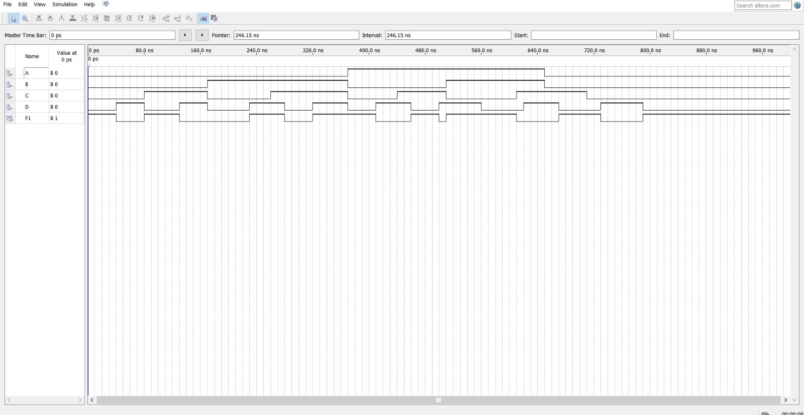

# Experiment--02-Implementation-of-combinational-logic

Program to implement the given logic function and to verify its operations in quartus using Verilog programming.

Developed by: Ashwin Kumar.S

RegisterNumber:  212222240013

## AIM:
To implement the given logic function verify its operation in Quartus using Verilog programming.

 F1= A’B’C’D’+AC’D’+B’CD’+A’BCD+BC’D
 
 
 
## Equipments Required:

 Hardware – PCs, Cyclone II , USB flasher

 Software – Quartus prime


## Theory
 
 Logic gates are electronic circuits which perform logical functions on one or more inputs to produce one output.

### OR Gate:

The OR gate is a fundamental digital logic gate that operates on two binary inputs, producing an output of 1 if at least one input is 1. It symbolizes logical disjunction and is essential in building logical circuits and decision-making processes in computers and electronics.

### AND Gate:

The AND gate is a fundamental digital logic gate with two inputs and one output. It produces a high output (1) only when both input signals are high (1). If any input is low (0), the output remains low. It's a building block for more complex logic circuits and is integral in digital computations.

### NOT Gate:

The NOT gate is a fundamental digital logic gate. It has a single input and a single output. The output is the inverse of the input: if the input is high (1), the output is low (0), and vice versa. It's a basic building block in digital circuits, used for logic inversion.

## Procedure

1.Create a New Project:

Open Quartus and create a new project by selecting "File" > "New Project Wizard."

Follow the wizard's instructions to set up your project, including specifying the project name, location, and target device (FPGA).

2.Create a New Design File:

Once the project is created, right-click on the project name in the Project Navigator and select "Add New File."

Choose "Verilog HDL File" or "VHDL File," depending on your chosen hardware description language.

3.Write the Combinational Logic Code:

Open the newly created Verilog or VHDL file and write the code for your combinational logic.

4.Compile the Project:

To compile the project, click on "Processing" > "Start Compilation" in the menu.

Quartus will analyze your code, synthesize it into a netlist, and perform optimizations based on your target FPGA device.

5.Analyze and Fix Errors:*

If there are any errors or warnings during the compilation process, Quartus will display them in the Messages window.

Review and fix any issues in your code if necessary.

View the RTL diagram.


6.Verification:

Click on "File" > "New" > "Verification/Debugging Files" > "University Program VWF".

Once Waveform is created Right Click on the Input/Output Panel > " Insert Node or Bus" > Click on Node Finder > Click On "List" > Select All.

Give the Input Combinations according to the Truth Table amd then simulate the Output Waveform.


## Program:
```
module proj2(A,B,C,D,F1);
input A,B,C,D;
output F1;
wire x1,x2,x3,x4,x5;
assign x1 = (~A)&(~B)&(~C)&(~D);
assign x2 = (A)&(~C)&(~D);
assign x3 = (~B)&(C)&(~D);
assign x4 = (~A)&(B)&(C)&(D);
assign x5 = (B)&(~C)&(D);
assign F1 = x1+x2+x3+x4+x5;
endmodule
```
## RTL Diagram:

## truth table:


## Timing Diagram:

## Result:
Thus the given logic functions are implemented using  and their operations are verified using Verilog programming.
